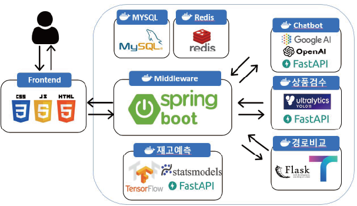
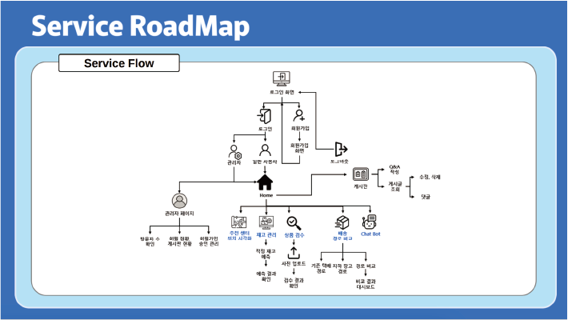

# 🚛 도심 물류 최적화 프로젝트 (Spring)

## 📌 프로젝트 개요
도심 내 물류 이동을 지하철도를 이용하여 효율적으로 최적화하는 시스템을 구축하는 프로젝트입니다. 
AI/ML을 활용하여 실시간 데이터 분석, 경로 추천, 비용 절감, 상품 검수, 챗봇 등 여러 기능을 활용하여 사용자에게 최적의 경험을 주기 위한 목표로 개발하였습니다.

---

## 🏗️ 소프트웨어 아키텍처 
<p align="center">
  
</p>

## 🔄 서비스 플로우
<p align="center">
  
</p>

---

## 🛠️ 기술 스택
- **Backend:** Spring Framework, JPA, FastAPI (외부 통신), Spring Security
- **Database:** MySQL, Redis
- **Frontend:** jQuery, Mustache, JavaScript
- **Monitoring:** Metrics
- **Deployment:** Docker, Azure

---

## 🚀 주요 기능
- **(FastAPI) Tmap API를 활용한 경로 추천 및 비교 서비스** (FastAPI 개발: MZ)
- **(FastAPI) YOLO v11을 활용한 상품 비교 검수** (AI 모델 개발: JH)
- **(FastAPI) LSTM을 활용한 물류량 예측** (데이터 분석: GH)
- **(FastAPI) 최적 입지 추천 서비스** (입지 분석 모델 개발: CR)
- **(FastAPI) 사용자 최적 경험 챗봇 서비스** (챗봇 서비스 개발 : DA) 
  - Github 주소 : https://github.com/daetu01/DistributionPChatbot
- **실시간 물류 데이터 처리**: Redis를 활용한 JWT Refresh Token 저장 및 빠른 데이터 접근
- **경로 최적화**: JPA를 활용한 데이터 저장 및 경로 분석
- **실시간 모니터링**: Metrics를 통한 시스템 상태 모니터링
- **API 통신**: FastAPI와의 연동을 통한 데이터 교환
- **프론트엔드**: Mustache 및 jQuery를 활용한 UI 렌더링
- **권한 인증**: Spring Security 및 JWT 기반 인증/인가 처리
- **예외 처리**: 글로벌 예외 처리 핸들러 및 커스텀 예외 처리
- **필터 처리**: JWT 인증 필터 및 요청/응답 로깅 필터
- **클라우드 배포**: Docker 기반 컨테이너화 및 Azure 배포

## 📂 프로젝트 구조
<details>
  <summary>프로젝트 폴더 구조</summary>

```bash
📦 pj
├── 📁 src
│   ├── 📁 main
│   │   ├── 📁 java/com/ai/pj
│   │   │   ├── 📁 client
│   │   │   │   ├── 📁 api
│   │   │   │   └── 📁 dto
│   │   │   ├── 📁 config
│   │   │   ├── 📁 controller
│   │   │   ├── 📁 restcontroller
│   │   │   ├── 📁 service
│   │   │   ├── 📁 security
│   │   │   │   ├── 📁 authentication
│   │   │   │   ├── 📁 details
│   │   │   │   ├── 📁 filter
│   │   │   │   ├── 📁 handler
│   │   │   │   ├── 📁 jwt
│   │   │   │   └── 📁 repository
│   │   │   ├── 📁 exception
│   │   │   ├── 📁 mapper
│   │   │   ├── 📁 repository
│   │   │   ├── 📁 dto
│   │   │   ├── 📁 domain
│   │   │   └── PjApplication.java
│   ├── 📁 resources
│   │   ├── 📁 database
│   │   ├── 📁 static
│   │   │   ├── 📁 css
│   │   │   ├── 📁 fonts
│   │   │   ├── 📁 img
│   │   │   └── 📁 js
│   │   ├── 📁 templates
│   │   │   ├── 📁 admin
│   │   │   ├── 📁 board
│   │   │   ├── 📁 common
│   │   │   ├── 📁 inspect
│   │   │   ├── 📁 map
│   │   │   ├── 📁 stocks
│   │   │   ├── 📁 storage
│   │   │   ├── 📁 user
│   │   │   └── home.mustache
│   │   ├── application.yml
│   │   ├── application-local.yml
│   │   ├── application-test.yml
│   │   └── application-dev.yml
│   ├── build.gradle
│   └── dockerFile
```

</details>


## 📌 맡은 역할
- **백엔드 총괄**: 백엔드 설계 및 가이드 코드 작성, MVC 구조 분리
- **데이터 총괄**: 데이터베이스 설계 및 최적화
- **JWT + Redis 활용한 로그인 구현**
- **Metrics를 활용한 관리자 페이지 로그 구현**
- **JPA 설계 및 최적화**
- **Spring Security 기반 권한 인증 및 JWT 적용**
- **예외 처리 시스템 구축 (GlobalExceptionHandler)**
- **JWT 필터 및 요청/응답 로깅 필터 구현**
- **Docker 기반 컨테이너화 및 Azure 배포 진행**

## 👥 기여자 (In Spring) 
- 🧑‍💻 **MJ** - FastAPI 기반 경로 추천 및 비교 서비스 개발, 백엔드 전반 기여, 프론트엔드 대다수 참여
- 🧑‍🎨 **JH** - YOLO v11 기반 상품 검수 모델 개발, 프론트엔드 
- 🧑‍🔬 **GH** - LSTM을 활용한 물류량 예측 모델 개발, 게시판 기능 구현, 백엔드 전반 참여, Cloud 배포 기여, Git 관리 
- 🧑‍🏫 **CR** - 최적 입지 추천 모델 개발, 프론트엔드 총괄 

## ⚡ 설치 및 실행 방법
### 1. 프로젝트 클론
```bash
git clone https://github.com/your-repository/DistributionP.git
cd DistributionP
```

### 2. 백엔드 실행
```bash
./mvnw spring-boot:run
```

### 3. 프론트엔드 실행
프론트엔드는 Mustache를 이용하여 서버에서 렌더링됩니다.

### 4. FastAPI 서버 실행 (필요 시)
```bash
uvicorn app:main --host 0.0.0.0 --port 8000
```

## 📊 시스템 모니터링
- Spring Actuator 및 Metrics 활용
- Redis 상태 확인: `redis-cli monitor`

